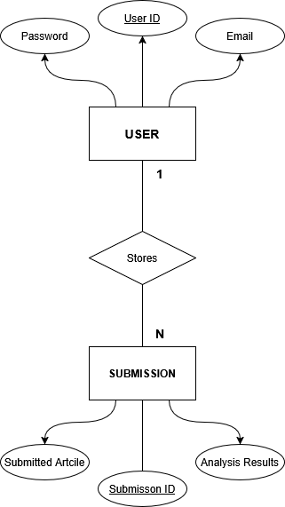
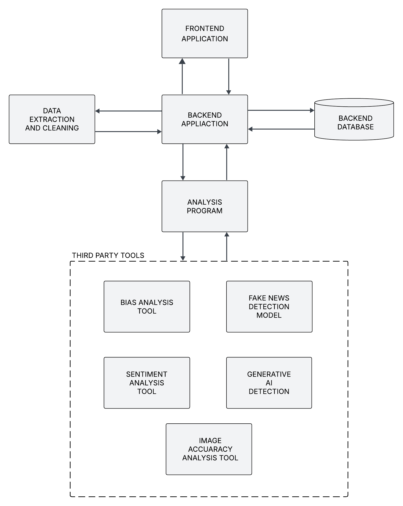
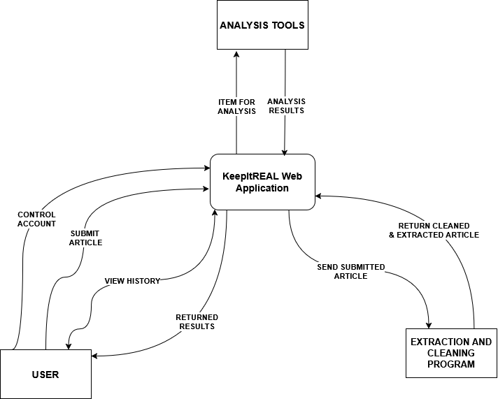
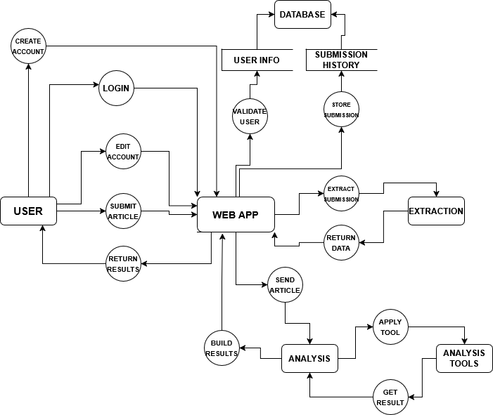
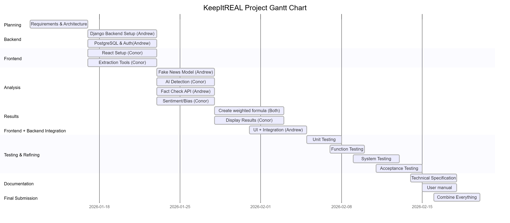

# **KeepItREAL FUNCTIONAL SPECIFICATION - CSC1049**

**Group Members:**

| **Student Name** | **Student ID** |
| ---------------- | -------------- |
| **Conor Weir** | **23418374** |
| **Andrew Brady** | **23447126** |

## **Table of Contents**

### 1\. Introduction

1.1 [Purpose](#11-purpose)

1.2 [Scope](#12-scope)

1.3 [Definitions, Acronyms, and Abbreviations](#13-definitions-acronyms-and-abbreviations)

1.4 [References](#14-references)

1.5 [Overview](#15-overview)

### 2\. The Overall Description

2.1 [Product Perspective](#21-product-perspective)

2.2 [Product Functions](#22-product-functions)

2.3 [User Characteristics](#23-user-characteristics)

2.4 [Operational Scenarios](#24-operational-scenarios)

2.5 [Constraints](#25-constraints)

### 3\. Specific Requirements

3.1 [External interfaces](#31-external-interfaces)

3.2 [Functional Requirements](#32-functional-requirements)

- 3.2.1 [User Account Creation](#321-user-account-creation)

- 3.2.2 [User Account Login](#322-user-account-login)

- 3.2.3 [URL Article Submission and Extraction](#323-url-article-submission-and-extraction)

- 3.2.4 [Raw Text Article Submission](#324-raw-text-article-submission)

- 3.2.5 [File Article Submission and Extraction](#325-file-article-submission-and-extraction)

- 3.2.6 [Extracted Article Cleaning](#326-extracted-article-cleaning)

- 3.2.7 [Analysis on Article](#327-analysis-on-article)

- 3.2.8 [Trustworthiness Calculation and Breakdown Construction](#328-trustworthiness-calculation-and-breakdown-construction)

- 3.2.9 [View User History](#329-view-user-history)

- 3.2.10 [Delete User History](#3210-delete-user-history)

- 3.2.11 [Edit User Account](#3211-edit-user-account)

- 3.2.12 [Delete User Account](#3212-delete-user-account)

3.3 [Software System Attributes](#33-software-system-attributes)

- 3.3.1 [Reliability](#331-reliability)

- 3.3.2 [Availability](#332-availability)

- 3.3.3 [Security](#333-security)

- 3.3.4 [Usability](#334-usability)

### 4\. System Architecture

4.1 [System Architecture Diagram](#41-system-architecture-diagram)

4.2 [Frontend Application](#42-frontend-application)

4.3 [Backend Application](#43-backend-application)

4.4 [Backend Database](#44-backend-database)

4.5 [Data Extraction and Cleaning](#45-data-extraction-and-cleaning)

4.6 [Analysis Program](#46-analysis-program)

### 5\. High-Level Design

5.1 [System Context](#51-system-context)

5.2 [System Data Flow](#52-system-data-flow)

### 6\. Preliminary Schedule

6.1 [Gantt Schedule Explanation](#61-gantt-schedule-explanation)

# 1\. Introduction

## 1.1 Purpose

The following functional specification document presents a detailed description of the functional and non-functional requirements of the KeepItREAL web fake news detection application. This document establishes what the system will do and its capabilities, the constraints under which the system must operate and the intended behaviour. This document is intended for the system designers, the project co-ordinator of the system, and the CSC1049 examiners.

## 1.2 Scope

The KeepItREAl web application will aid users in navigating the modern world of online news (including user generated content and independent new sources) with its abundance of inaccurate, AI generated, misleading and fake information that has come with 'The Age of Technology".

KeepItREAL will provide an interface for users to upload articles of news via:

- URL
- Raw Text
- .doc/.docx files
- .ppt/.pptx files
- .md files
- .txt files

These submissions will be analysed for accuracy of information, source reliability, and overall trustworthiness.

The analysis will include metrics which will determine a “trustworthiness score” for the submitted piece of news based on a range of metrics based on fact checking, sentiment analysis, bias analysis, and AI generated content detection, with each metric applied a weight, constructing a part of the resulting trustworthiness score.

Using these metrics to get the trustworthiness score, KeepItREAL’s system provides a breakdown of the specific contribution of each metric to the final score, thus allowing  users to make informed decisions on the information provided in the submitted piece of news.
The system will also provide a user login system to save previous submissions and resulting analysis’ in a history, allowing them to be accessed at any time.

KeepItREAL will only perform ethical collection of news content, and will avoid scraping from  websites which specify they do not consent to having their content taken.

The KeepItREAL application is not a “True or False” fake news analysis system and is intended to provide valuable information to allow users to form an individual opinion on the news they digest using the fine-grained trustworthiness breakdown the system provides, as the system does not guarantee the absolute accuracy of its results.

## 1.3 Definitions, Acronyms, and Abbreviations

For the remainder of the document, the KeepItREAL web application will simply be referred to as the web application/web app unless specified otherwise.

**CORS - Cross-Origin Resource Sharing:** CORS is an HTTP-header based mechanism that allows a server to indicate any origins (domain, scheme, or port) other than its own from which a browser should permit loading resources.

## 1.4 References

- mdn web docs, "Cross-Origin Resource Sharing (CORS) - HTTP | MDN," MDN Web Docs, Mar. 14, 2025. <https://developer.mozilla.org/enUS/docs/Web/HTTP/Guides/CORS>

- Cloudfare, "What is bot traffic? | How to stop bot traffic," _Cloudflare.com_, 2024. Available: [What is bot traffic? | How to stop bot traffic | Cloudflare](https://www.cloudflare.com/en-gb/learning/bots/what-is-bot-traffic/)

- “Blog - How to create data flow diagrams in draw.io,” _drawio.com_, Jul. 27, 2023. <https://www.drawio.com/blog/data-flow-diagrams>

- Lucidchart, “What is a Data Flow Diagram,” _Lucidchart.com_, 2022. <https://www.lucidchart.com/pages/data-flow-diagram>

- “What is a context diagram and how do you use it?,” MiroBlog, May 18, 2022. <https://miro.com/blog/context-diagram/#Header2>

- B. Balter, “Word to Markdown,” Word2md.com, 2025. <https://word2md.com/>

- “Mermaid Chart,” Mermaidchart.com, 2025. Available: <https://www.mermaidchart.com/app/projects/a92929a0-a3f0-4617-bab0-53ce9e9c80d9/diagrams/f5793a90-3c82-4e10-8564-3aa06161207e/version/v0.1/edit>

## 1.5 Overview

### Section 2
Section 2 contains 2.1 where we compare our webapp to other existing products such as Google Fact Check. Then we go into an in-depth description of the product functions such as article submission in section 2.2. Next is the user characteristics where we discuss the ideal characteristics for our users in section 2.3. Then in section 2.4 we talk about different operational scenarios where we have different types of users including unregistered users and registered users who are not logged in. Finally for section 2.5 we show the constraints of our webapp.
### Section 3
The first sub section of section 3 is section 3.1 External Interfaces. Here we discuss the different APIs and libraries we are planning to use for our webapp along with a general description of the task they perform. Then for section 3.2 we talk about different functional requirements with examples including user account login and article submission. Section 3.3 has the heading Software System Attributes where we discuss the different non-functional requirements.
### Section 4
Section 4.1 we have a diagram that depicts the systems architecture, in the following sub sections we give an in-depth analysis of each section mentioned in the system architecture diagram.
### Section 5 
For section 5 we have two separate diagrams. The first one is a context level flow diagram and the following explanation explains how the diagram is similar to the system architecture where it displays the main flow of the system with the external entities. The second diagram depicts a level 1 data flow diagram that depicts the flow of data throughout the internal and external entities.
### Section 6
Then for the final section we have a gantt chart. This outlines our plan of implementation and documentation for the next part of the project submission. It starts at the beginning of the second semester and goes all the way up to the submission deadline.

# 2\. The Overall Description

## 2.1 Product Perspective

This web application system is an independent and self-contained system that provides users an interface to evaluate the credibility and trustworthiness of their user generated content or independent news sources. Although the system forms a complete product on its own, the system utilises external 3rd party tools in order to aid the analysis process, as defined in the below sections. A similar webapp would be Google Fact Check where it determines the validity of news articles through human fact checking. So the webapp differs in that ours is trying to be a bit more automated.

### 2.1.1 Software Interfaces

#### React

- **Name:** React
- **Version:** latest 19.2
- **Source:** <https://react.dev/>

#### Tailwind CSS

- **Name:**  Tailwind CSS
- **Version:** 4.0
- **Source:** <https://tailwindcss.com/>

#### Django 

- **Name:**  Django
- **Version:** 5.2.8
- **Source:** <https://www.djangoproject.com/>

#### PostgreSQL

- **Name:**  PostgreSQL
- **Version:** 18
- **Source:** <https://www.postgresql.org/>

#### Newspaper3k

- **Name:**  Newspaper3k
- **Version:** pypi package 0.2.8
- **Source:** <https://pypi.org/project/newspaper3k/>

#### Pypdf

- **Name:** Pypdf
- **Version:** N/A
- **Source:** <https://dpf.docs.pyansys.com/version/stable/api/index.html>

#### Docxtract

- **Name:** Docxtract
- **Version:** v1
- **Source:** <https://rapidapi.com/docxtract/api/docxtract1>

#### Pulk17 Pretrained Fake News Detection Model

- **Name:** Pulk17 Pretrained Fake News Detection Model
- **Version:** v1
- **Source:** <https://huggingface.co/Pulk17/Fake-News-Detection>

#### Twinword Text Analysis Bundle

- **Name:** Twinword Text Analysis Bundle
- **Version:** v1
- **Source:** <https://rapidapi.com/twinword/api/twinword-text-analysis-bundle>

#### Google Fact Check Tools API

**Name:** Google Fact Check Tools API
**Version:** v1
**Source:** <https://toolbox.google.com/factcheck/about#fce-included>

#### Biaslyze

**Name:** Biaslyze
**Version:** v1
**Source:** <https://biaslyze.org/api/#concepts>

#### Hello-SimpleAI AI Detector Model

- **Name:** Hello-SimpleAI AI Detector Model
- **Version:** v1
- **Source:** <https://huggingface.co/Hello-SimpleAI/chatgpt-detector-roberta>

## 2.2 Product Functions

The web application will provide the following major system functions with the main overall goal of the application being as defined in the scope of the document.

### User Account Functions

Handling user account functionality with the following functions:

- Account Creation
- Account Deletion (Requires Log In)
- Edit Account Information (Requires Log In)
- Account Log In
- Account Log Out (Requires Log In)

### News Article Submission

Provides the interface for users to submit articles to be analysed through an appropriate format (URL, text, or a supported file format) and sends the submission to the backend for the article to be extracted. Users are able to select which metrics of analysis they want to apply/not apply before sending the article for submission. By default, all analysis metrics are applied however if a user wishes they can change this. This is carried out using these functions:

- Display submission interface
- Select analysis metrics
- Validate submission
- Send submission to backend

### Article Extraction and Cleaning

Takes an article submission and parses/splits it into the important details needed for analysis such as text, images, metadata, etc., with the following functions:

- Extract Article Title
- Extract Article Authors
- Extract Article Text
- Extract Images
- Extract Date
- Clean Article Data

### Analysis Functions

Performs the analysis procedures on extracted news articles using specified metrics and getting the results:

- Fact Check Article
- Sentiment Analysis on Article
- Bias Analysis on Article
- Image Analysis on Article Images
- Detect AI Generation

### Trustworthiness Computation and Breakdown

Computing the final trustworthiness score by applying weights to each metric which composes part of the final score (as a percentage out of 100) and building the breakdown of results:

- Compose Final Score
- Compose Breakdown of Results

### Presentation of Results

Combines and displays information curated from results of the analysis' on submitted articles of news:

- Display Trust Score
- Display Breakdown

### User History Management (Requires Logged In Account)

Allows users with authenticated/logged in account to access previous submissions and their analysis:

- View submission history
- Access previous submission
- Delete submission from history

## 2.3 User Characteristics

Our target demographic for users is anyone who consumes media at any level. There is no established age for this but generally between the ages of 15-65 is where most users would be on the web interacting with a form of media outlet. There would be no need for prior education relevant to the page. The user would need a very basic level of computing ability where they are able to copy URL's or text and paste it into the desired section of the webpage.

However, the most common form of media we are focused on is news outlets. So, the more niche user is one who frequently access online news. This target demographic we estimate to be around 30-55 with obvious outliers.

**Wishlist:**

- The user has a basic knowledge of computing ability
- The user has a basic digital literacy
- The user can interpret the result
- The user has no malicious intent for the system
- The user understands that the trustworthiness score is not 100% accurate

## 2.4 Operational Scenarios

### Unregistered Users

#### Submit Article:

The user can select the form of article submission from the supported formats and send the article of news to the web application to be analysed. The results from the submitted article will then be displayed to the user, showing the overall trustworthiness of the article, as well as a short summary of what this result means. The user will then have the option to expand on this reasoning of the results to see the breakdown of the analysis.

#### Create Account:

The user can create an account to allow them to have access to storage of previous submissions to the web application. The user will use their details (email, username, password) to create an account, given that an account with the same details does not already exist and they are using a secure password.

### Registered Users (Not Logged In)

This scenario is for a registered user with an account who has not logged in yet. They have all the functionality of an unregistered user but will not gain full functionality until they login.

#### Log in:

The user can access the login page where they enter their registration details (username, email, password) and submit them to get authenticated. Once approved they will gain access to all the functionality of the webapp.

### Registered Users (Logged In)

This is for the user who is registered and logged in to their account. They have all the functionality of a registered user who is not logged in with the added benefit of access to the whole functionality of the webapp.

#### Access previous submission:

The user has the option to access a previous submission to see the link they sent in and the results from the submission alongside the breakdown of the results.

#### View whole history:

The user has access to the whole history of submissions in their account. They can see all the links from previous submissions to copy them in case they want to access them again or resubmit.

#### Edit details:

The user can update their details with more up to date information through their account information. They can edit their profile details such as their chosen username or change the password.

#### Delete account:

The user can access their account information and delete their account. The user will be asked to verify their deletion by logging in again using their details and password. Upon verification, their account will be deleted from the account storage.

#### Delete history:

The user can delete individual previous submissions stored in their submission history or have the option to clear the whole history if they do not want any of their submissions stored.

#### Log Out:

The user can log out of their account to ensure the security of their account access so that they must log in every time.

## 2.5 Constraints

### Regulatory Policies

Many websites such as news pages have terms of services that the user must comply with. This involves the unethical scraping of data from their websites which can cause them to ban users from the webpage. We make sure to adhere to the user terms of service and Robots.txt (standard location for websites to store information relating to web scrapers) when applying our web scraping tools.

The third-party tools used for article extraction and analysis also have usage policies, potential licensing terms or rate limits which the system must follow.

Adherence to GDPR must be taken into consideration as we are handling user data such as name and email for user authentication. The system will protect user information in the case of any attacks.

### Interface to Other Applications

The system is somewhat dependent on external, third-party tools for analysis and text extraction services.

The connection from the frontend to backend may be constrained through the security mechanisms enforced by CORS.

### Parallel Operation

The system must be able to handle concurrent submissions from multiple users and handle the external API calls and responses. The system must be able to handle these requests without an extreme drop in response efficiency and ensure that a bottleneck situation does not arise. In handling the responses the system must ensure the responses do not get misrouted and arrive to the correct user.

### Control Functions

To operate the system the user must first pass the user authentication to stop users with malicious intent. Only users with authorised access can see the data that is being stored in the database. Another control function will be rate limiting to prevent DoS attacks/ bot attacks.

### Reliability Requirements

If certain analysis tools fail to produce a result for composing part of the final trustworthiness, the system should be handled gracefully and still generate a final score while informing the user with the failure using appropriate error messaging.

The response from one user submission should generate similar results, and should not vary largely in the general context of the response.

The web application should be able be run in all modern mainstream browsers, such as Chrome, Edge, Firefox, Safari, etc.

### Criticality of the Application

The user needs a reliable outsource option to have information be fact checked so that they are not consuming fake, bias or synthetic media.

The system must therefore provide accurate and consistent results as it will undermine the user's confidence in the tool. This should be provided alongside a breakdown of the score to show the reasoning behind the final result.

### Safety and Security Considerations

As mentioned in the control functions there will be user authentication and rate limiting for added security. The API keys should also not be able to be accessed by users and must be stored securely.

# 3\. Specific Requirements

## 3.1 External Interfaces

### newspaper3k: 
This is one of the Python libraries used for scrapping the metadata and images from URLs. The URLs are given to us from the user through the submission input box where they can copy and paste the URL in. Then take that url and send it to this API which will return the metadata and images it has extracted from the website as raw text. After this send the response to our data cleaning function to later be sent for analysis.

### pypdf: 
This is another Python library used for extracting articles of texts from pdfs. The pdfs are another form of submission for the user. Once we get all the extracted text we will send it to be cleaned before sending off to the other external analysis APIs

### Docxtract: 
This is similar to the previous pypdf except this is an API that extracts articles of text from multiple files including:
-	Doc/docx
-	.ppt/.pttx
-	.md
-	,txt
Once the data from the files is obtained we once again sent it to be cleaned and then we will send them off to the analysis APIs.

### Pulk17 Pretrained Fake News Detection Model:
This is a pretrained model API that we found on hugging face which classifies articles of text as real or fake in the form of a confidence score. It will be sent the cleaned data received from our aforementioned extraction tools. The confidence score will then be given a weight upon response to use for our overall “trustworthiness score”.

### Twinword Text Analysis Bundle: 
This is an API that contains multiple functions around analysing human text, one of which is a Sentiment Analysis. This will be sent the cleaned data from the extraction tools as well. Then in our response we will receive either a “positive”, “neutral” or “negative” with a confidence score. This will then be added to the calculation of the of the “trustworthiness score”.

### Google Fact Check Tools API:
The Google Fact Check Tools API is given text or a heading that we will extract from the article. It uses this input to search through manually fact checked articles to see if they have fact checked it. It returns a result to us in the format of true/false or needs to be checked. This will probably be a heavily weighted result when it gets sent to calculate the “trustworthiness score”.

### Biaslyze:
This is a python library that texts in text and performs an analysis of the text for bias using NLP models. The output comes in the form of a JSON-like object that includes the type of bias as well as a confidence score of the bias. This will be extracted and cleaned to then be sent for calulcation of the “trustworthiness score”.

### Hello-SimpleAI AI Detector Model: 
This is another pre-trained model used to detect human vs ChatGPT text with a confidence score of the result. The output will inform us whether or not the text was created by a human. This response will be used for the calculation of the “trustworthiness score”.

## 3.2 Functional Requirements

### 3.2.1 User Account Creation

#### Description

The system shall handle the creation of a new user account where it prompts the user to enter their email address, create a username and create a password. The system shall store these details in the database so that they can authenticate future logins for the user.

#### Criticality

This is an essential for step for the system for authentication. Without this the system will not be able to handle user logins. This allows the user to interact with the all the functions the system offers. Without it the system would not store any of their previous submissions.

#### Technical Issues

The issues for this functional requirement are to make sure the users details are handled and stored correctly. The system needs to make sure that each email address and username entered are unique to avoid duplicates and prevent future errors within the system.

#### Dependencies with other requirements

No dependencies

### 3.2.2 User Account Login

#### Description

The system shall be able to access the database to authenticate the user credentials entered by the user. The system shall give the user access to all functions once login is authenticated.

#### Criticality

This is essential to ensure that the user has an account before giving them full operation of the webapp. The account needs to verify the details from the database. Once they are logged in they can now also receive the submission history linked to those account details.

#### Technical Issues

The user must have already created an account to match the details to in the database. If the user has not created an account, the system shall handle this by prompting the user with a link to register an account

#### Dependencies with other requirements

This requirement is dependent on the creating account requirement. Without it the user login cannot be authenticated.

### 3.2.3 URL Article Submission and Extraction

#### Description

The system shall scrape all the meta data from the URL provided from the user. The system will use this data will then be cleaned before eventually sending it off to the external APIs. The system shall store the URL in a database to allow the user to access their history.

#### Criticality

This is one of the main functions of the webapp making it very critical. The user must be able to submit URL's and we have to be able to extract the data otherwise we cannot send the data to the external APIs and give the user back a "trustworthiness score".

#### Technical Issues

The system must be able to handle the scenario where the user enters a URL that does not exist. When it tries to send the URL to the extraction tool the extraction tool will respond with an error that the system needs to handle and provide the user with an appropriate response.

#### Dependencies with other requirements

The only dependencies would be the user logging in and having an account if they want to save their submission so they can look back at their history.

### 3.2.4 Raw Text Article Submission

#### Description

The system shall handle the user entering pure raw text that they want to fact check. The system shall be able to take the text, save it in a database and send a request to the API with the text data included in the request.

#### Criticality

The criticality of this is also very high as this is a main function of the webapp. The user needs to be able to enter text so that they can get a "trustworthiness score". While there is other forms of submission the user needs access to all forms to ensure they can fact check their required form of media.

#### Technical Issues

The user does not enter enough text information for the external APIs to give an accurate response making an invalid "trustworthiness score". The system shall prompt the user with an appropriate message saying the text does not meet the minimum requirement length.

#### Dependencies with other requirements

The dependencies are similar to the previous requirement in that it is only dependent on the create account and login requirements if the user wants access to their submission history.

### 3.2.5 File Article Submission and Extraction

#### Description

The system shall handle the submission of an article from the user that they wish to check. The system shall send the necessary information from the file to send on to be extracted.

#### Criticality

This is also critical like the previous two requirements in that this is a main function of the system. The user needs to be able to enter files in the scenario they have downloaded the data they want to receive a "trustworthiness score".

#### Technical Issues

The system needs to be able to handle an unsupported file type by prompting the user with an appropriate error response explaining the file types it supports. The system shall also appropriately handle the scenario where the user submits a blank file with no text for the extraction tool.

#### Dependencies with other requirements

Similarly to the previous two the only scenario that this is dependent on other requirements is when the user wants to access their history. To access their history they must have already created an account and have logged in.

### 3.2.6 Extracted Article Cleaning

#### Description

The system shall use the appropriate extraction tool depending on the form of submission the user chooses. The system shall take the extracted information to be cleaned before being sent to an external API.

#### Criticality

This is a critical functional requirement as the extraction tools need to scrape the necessary details so that we can clean them to be able to form a request to the external APIs. This means that we can also receive a response to get an overall trustworthiness score.

#### Technical Issues

The tool fails to extract the appropriate data due to errors such as the URL being broken, the file being empty etc. This then prevents the system from performing the necessary cleaning of the data. The system shall handle these errors by prompting the user with an appropriate message to solve these errors.

#### Dependencies with other requirements

This requirement is dependent on the three submission requirements. If the user has not made any submissions, then the extraction tools cannot be used and there is no data for the system to clean.

### 3.2.7 Analysis on Article

#### Description

The system shall take the cleaned data and send requests to the appropriate external APIs. They will send a response to the system that the system will store to perform further operations on.

#### Criticality

This is of high criticality as the system needs to be able to send the data to the APIs to perform their analysis. Without this the user will not be able to receive a "trustworthiness score" and the process so far would be pointless.

#### Technical Issues

One issue that could arise is that the external APIs are down or do not send responses to the system. In this scenario the system shall still create a "trustworthiness score" with the received results and explain in the breakdown what APIs were unavailable to perform their analysis.

#### Dependencies with other requirements

This functional requirement is dependent on one of the submission requirements and the extracted article cleaning requirement. The system must have some form of clean data to send to the APIs so that an analysis can be performed.

### 3.2.8 Trustworthiness Calculation and Breakdown Construction

#### Description

The system shall combine all the results from the respective APIs analysis' to calculate the overall "trustworthiness score". The system shall also provide the user with a breakdown of this score and how the score is constructed.

#### Criticality

This is of very high criticality as this is the main output of the webapp so that the user can decide on how much they trust the media they entered. If there is no "trustworthiness score" from the calculation the user will not have received a result so the operation will not have mattered.

#### Technical Issues

Similar to the previous requirement if some of the APIs are not working this will cause the result to be skewed. The system shall handle this by still calculating a score but mentioning the issue to the user in the breakdown.

#### Dependencies with other requirements

This is dependent on the analysis requirement, the extract and clean data requirement and one of the forms of submission. These are necessary to get a request to the API so that the system can handle the result and calculation/breakdown.

### 3.2.9 View User History

#### Description

If the user is logged in then the system shall display the user's history of previous submissions. The user will be able to access these submissions and see the results that system has stored in the database.

#### Criticality

This is of middle level criticality as it is not critical for the user to be able to access their history, but it is one of the benefits of the user creating the account. Without this functionality the user would never need to create an account.

#### Technical Issues

The user does not have an account created so the system shall know not to try store the user's submission in the database. The system shall also make sure that there is unique usernames and emails so that it knows what user to history to display to prevent the wrong history being sent to a user.

#### Dependencies with other requirements

This functional requirement is dependent on the "User Account Login" requirement as only logged in users are able to have their data stored. This therefore also encompasses the "User Account Creation" requirement as the account must exist for its submission history to be saved in the database.

### 3.2.10 Delete User History

#### Description

The system shall allow logged in users to delete individual, or all, previous submission history stored to the web applications database. The system shall confirm that the user wants to delete selected submission history items before deleting the items to prevent erroneous actions.

#### Criticality

This functional requirement is not a system critical requirement, and the system shall still function outside of this functional requirement without consequence.

#### Technical Issues

The user accidentally deletes historical submissions without any way of undoing or reversing this action.

If there are no submissions in the history, this requirement is also unsatisfiable, however this is not an issue and is the intended functionality.

#### Dependencies with other requirements:

This functional requirement is dependent on the "User Account Login" requirement as only logged in users are allowed to delete their submission history. This therefore also encompasses the "User Account Creation" requirement as the account must exist for the history to be deleted from the database.

### 3.2.11 Edit User Account

#### Description

The system shall allow logged in users to view their account details and change any of these details. The system shall store all of this information related to a user account. Upon the user making the account information changes, the system shall ask for the user to verify their account information to prevent malicious changes to account information. Upon correct verification, the system shall change the stored account details to the user specified changes.

#### Criticality

It is not critical to the system that the user be able to change their account information, however now allowing for a user to be able to edit their account information may result in outdated or incorrect information being set to user accounts.

#### Technical Issues

The replacement account information to be edited to must still be valid to change to (for example, a changed email address must still be a valid email and must not already have an account bound to it, a changed password must still be a valid, strong password). Upon attempted invalid information editing, the system shall not update the details, and shall inform the user with a correct error message for the issue.

#### Dependencies with other requirements

This functional requirement is dependent on the "User Account Login" requirement as only logged in users are allowed to edit their account details. This therefore also encompasses the "User Account Creation" requirement as the account must exist for its information to be edited.

### 3.2.12 Delete User Account

#### Description

The system shall allow logged in users to view their account details and from there, delete their account. The system shall be aware of all accounts which exist in the system and allow for deletion when specified. It will be necessary for users to verify their login before deletion by logging in again, and verifying they want to continue with the deletion.

#### Criticality

The account deletion functionality is not essential to system operations, however it is good ethics to allow for users to remove their details from the system upon request.

#### Technical Issues

For deletion users must login again to verify the deletion, therefore the technical issues are the same for deleting a user account, such as if the password verification fails/is incorrect, the system shall gracefully return to the safe state of viewing account information, without deleting the account and prompting users with the appropriate error message and to try again.

#### Dependencies with other requirements

This functional requirement is depended on the "User Account Login" requirement as only logged in users are allowed to delete their account. This therefore also encompasses the "User Account Creation" requirement as the account must exist for it to be deleted.

## 3.3 Software System Attributes

### 3.3.1 Reliability

If a selected 3rd Party Analysis metric fails, the system shall continue to form a partial result based on the successful completion of the remaining analysis metrics. The system shall inform the user, however, of the failing of the specific analysis metric and include in the results breakdown what analysis is missing due to the failure and how this affects the results, while informing the user to attempt again for a full response.

If an external extraction tool fails, the system shall not fail, and instead inform the user of the other possible ways they can still submit the same article through one of our other forms of valid submission.

### 3.3.2 Availability

The system shall be available 24/7, accessible through the web application at any time.

### 3.3.3 Security

Sensitive user details shall be hash encrypted as they are stored in a database in order to ensure security among user accounts. The system shall also restrict access to information based on the user’s validated identity (so no access to other users information).

The system shall require users to authenticate (i.e. login) before being allowed to access user specific features. The system shall validate all authentication attempts to prevent malicious logins.

All user inputs (such as submissions or login attempts) shall be validated and checked to prevent malicious activity such as SQL injection or command injection. Any suspicious inputs shall be rejected by the system.

The system shall be rate limited to prevent brute force attacks to the web application.

### 3.3.4 Usability

The system shall integrate a clear and easy to use user interface, to allow for users of all technological expertise to utilise the system, especially as those less technologically experienced may struggle avoiding fake news sources online.

The system shall use the concept of affordances to make the functionality of the system available to the user, clear and informative.

## 3.4 Logical Database Requirements

The diagram depicts the data about the user and the article submissions being stored in the database. This relationship is one to many with multiple submissions being stored per user. The primary key for users is the user id. This primary key is used to query the database to find the associated user, we also store the email and password which will be hashed to protect the user details. 

Similarly to the users entity, we use submission id’s to differentiate between submissions and store the submitted article and the analysis result from the article. 

These entities will be used to support our user authentication system for user login. This will allow us to search if users already have an account and then fetch their submission history.

# 4\. System Architecture

### 4.1 System Architecture Diagram

### 4.2 Frontend Application

**Roles:**

- Display user interface.
- Collect user submissions and send to the backend application.
- Display trustworthiness results and breakdown.
- Fetch user history and user information and display them.
- Collect user information for account creation and login.

**Receives:**

- Results from analysis from the backend application.
- User history from the backend application
- User information from the backend application

**Sends:**

- Collected user information to the backend application.
- User submissions to the backend application.

### 4.3 Backend Application

**Roles:**

- Connects all sections of the total application together.
- Validate user submissions.
- Validate user information for account management.
- Send information to be stored in database.
- Send user submissions to be extracted and cleaned.
- Send extracted articles to be analysed.
- Collect analysis results and give to the frontend application.

**Receives:**

- User submissions from frontend application.
- User account information from frontend application.
- Requested information from backend database.
- Extracted and cleaned data from data extraction and cleaning program.
- Analysis results from analysis program.

**Sends:**

- User account information to backend database.
- User submission details to backend database.
- User submissions to data extraction and cleaning.
- Cleaned and extracted article data to analysis program.
- Results and breakdown of analysis to frontend.

### 4.4 Backend Database

**Roles:**

- Store protected user information.
- Store user submission history.
- Return requested information to backend.
- Update user information.

**Receives:**

- User account information from backend application.
- User submission information from backend application.

**Sends:**

- Requested user account information to backend application.
- Requested user submission information to backend application.

### 4.5 Data Extraction and Cleaning

**Roles:**

- Take valid user submission method and extract article information.
- Clean extracted information to remove unnecessary details so it can be analysed.

**Receives:**

- User submissions from backend application.

**Sends:**

- Cleaned article data from user submission to backend application.

### 4.6 Analysis Program

**Roles:**

- Conduct analysis metrics on user submission using 3rd Party Analysis Tools.
- Apply weights to each metric to form final score.
- Form results breakdown.
- Handle issues with 3rd Party Analysis Tools.

**Receives:**

- Cleaned user submission from backend application.
- Responses from 3rd Party Analysis Tools.

**Sends:**

- Appropriate submission data to analysis tools.
- Final analysis score and breakdown to backend application.

### 4.7 3rd Party Tools

**Roles:**

- Conduct sections of analysis process.
- Return response to the analysis program.

**Receives:**

- Data to be analysed from the analysis program.

**Sends:**

- Response of analysis to the analysis program.

# 5\. High-Level Design

In this section, the overall architecture design and main components are explained in relation to how they interact with each other and how information is shared between them. The context diagram below maps how external entities interact with our internal system, and we then detail the actual processes through the data flow section.

### 5.1 System Context

The context level data flow diagram above provides a high-level overview of the system architecture as a single process, showing how external entities interact with the internal web application. It displays the main flows of information in the system.

In the diagram, all internal components which make up the web application, including the frontend, backend, database and internal extraction and analysis programs, are all represented under the KeepItREAL Web Application, and we display only the interactions with the external entities.

The three main external entities:

- **User:** Represents any individual user of the web application.
- **Analysis Tools:** Represents the collection of external analysis tools which will conduct individual analysis metrics and return a result.
- **Extraction and Cleaning Program:** Represents any tools necessary to extract article data from valid submission types.

The diagram shows how information enters, moves around, and leaves the system without detailing how the information is handled.

### 5.2 System Data Flow

The above data flow diagram expands on the context level diagram, describing the processes between all internal and external entities within the system design. The diagram displays how the flow of data occurs through these entities.

In the diagram, the frontend and backend are combined into one internal entity for visibility in the diagram to make it easier to read. The only processes between these entities are the flow of submissions and user info from the frontend to the backend and the flow of results and previous submissions from the backend to the frontend.

The additional entities specified in the diagram compared to the context diagram:

- **Analysis:** The analysis entity represents the program which sends specific areas of article submissions to their appropriate analysis tool and combines all of the returned results to construct the whole analysis and breakdown.
- **Database:** The backend database contains all important data stores as specified in the diagram, such as user information and user history. It allows for the web application to query the database as needed to collect needed information.

# 6\. Preliminary Schedule

### 6.1 Gantt Schedule Explanation

Here we outline the schedule for our implementation of the webapp. Within each task we specify which team member will be the main programmer for that section. If we do not specify which team member then it will be performed by both of us. Each task has a section heading outlining the main operation we will be performing.

# 7\. Appendices

See section 1.4 for references for the document.