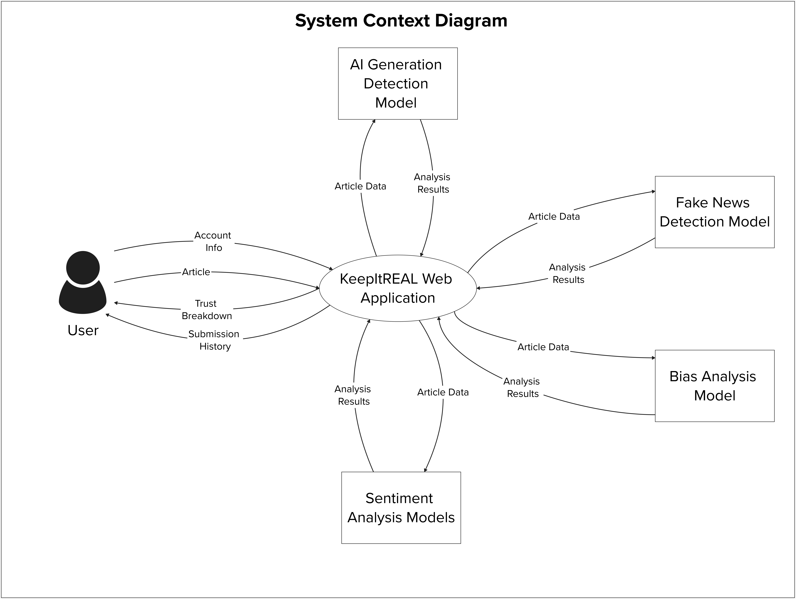

# **KeepItREAL Technical Specification - CSC1049**

**Group Members:**

| **Student Name** | **Student ID** |
| ---------------- | -------------- |
| **Conor Weir** | **23418374** |
| **Andrew Brady** | **23447126** |

## **Table of Contents**

### 1\. Introduction

1.1 [Purpose](#11-overview)

1.2 [Scope](#12-scope)

1.3 [Definitions, Acronyms, and Abbreviations](#13-definitions-acronyms-and-abbreviations)

1.4 [References](#14-references)

1.5 [Overview](#15-overview)

### 2\. System Architecture

2.1 [System Context](#21-system-context)

2.2 [System Architecture](#22-system-architecture)

2.3 [User Characteristics](#23-user-characteristics)

2.4 [Operational Scenarios](#24-operational-scenarios)

2.5 [Constraints](#25-constraints)

# 1\. Introduction

## 1.1 Purpose

The following technical specification document presents a detailed description of the initial and current design of the KeepItREAL web application. This outlines the architecture, functionalities and design for KeepItREAL.

## 1.2 Scope

This technical specification establishes the design and implementation created throughout the development of the KeepItREAL web application. Throughout this specification, we will cover:

- System Context/Overview
- System Architecture
- System Component Modeling (maybe)
- High-Level Design
- Problems Encountered and Their Resolutions
- Installation Guide

## 1.3 Definitions, Acronyms, and Abbreviations

For the remainder of the document, the KeepItREAL web application will simply be referred to as the web application/web app unless specified otherwise.

- **CORS - Cross-Origin Resource Sharing:** CORS is an HTTP-header based mechanism that allows a server to indicate any origins (domain, scheme, or port) other than its own from which a browser should permit loading resources.

- **Vite:** A build tool for React that aims to provide a faster and leaner development experience for modern web projects.

- **HMR - Hot Module Replacement:** A technique for updating modules in your app without needing to reload the page.

## 1.4 References

- [Django-React Software Architecture - Mahdia Aliyya (Medium)](https://mahdiaaliyya.medium.com/software-architecture-bb44325bf0cf)

- https://www.geeksforgeeks.org/blogs/why-choose-react-for-web-development/ 

- https://vite.dev/guide/

- https://reactrouter.com/explanation/hot-module-replacement

## 1.5 Overview

KeepItREAL is a web application that aids users with navigating the complexities of news browsing, avoiding bias opinions, lies and other forms of false information that exists within the world of online news.

KeepItREAL provides an interface for users to upload news articles to be analysed using detection methods and evaluation metrics (which will be spoken of in detail in this document). KeepItREAL provides multiple methods of news article submission to users, to cover the primary forms of news users will come across.

These methods of submission are:

- URL
- Raw Text
- .docx files
- .pptx files
- .html/.htm files
- .md files
- .txt files

These submissions are then analysed by the our application on four current metrics:

- Bias Analysis
- Sentiment Analysis
- AI Generated Content Analysis
- An Overall Fake News Analysis

This analysis determines a “trustworthiness score” for the submitted piece of news. Using the formula we curated, we weigh the results of these analysis' to get this final score.

As a part of the results, an explanation to the results is included as well, to provide context behind the results returned.

The appliaction also provides a user account system to save previous submissions and resulting analysis’ in a history, allowing them to be accessed at any time.

The KeepItREAL application is not just a “True or False” fake news analysis system and instead provides valuable information to allow users to form an individual opinion on the news they digest.

### 2\. System Architecture

## 2.1 System Context

In figure 2.1.1, we see at a very basic and high-level view how the KeepItREAL system operates to achieve the goal of our system, including how our system interacts with external nodes in the context of the system.

This diagram does not include all information on the relationships and nodes in the system (which will be explained later) but but explains an overview of how the system works. For simplicity, this diagram hides all internal system functionality.

**Figure 2.1.1** *System Context Diagram showcasing a high-level view of the KeepItREAL system in the basic context of how the system works and interacts with external actors.*

## 2.2 System Architecture

### 2.2.1 Architecture Overview

The System Architecture diagram (seen below in figure 2.2.1.1) displays the architectural structure of the KeepItREAL web application, following a classic React-Django structure using the Django REST Framework and Vite, as well as a PostgreSQL Database.

The services which make up the frontend and backend in the diagram are not the exact/all of the services in these areas and, for the purpose of readability, multiple services may be represented as one service in the diagram, however this will be discussed more in the following sectioms.

**Figure 2.1.1.1** *System Architecture Diagram displaying how external components and the internal frontend, backend and database are structured and interact with each other. A key is provided on the right-side of the diagram.*

### 2.2.2 The Frontend (VITE REACT (JS)) Architecture

The frontend layer of the web application was implemented using ReactJS for creating a dynamic and fast-to-build capabilities due to its component-based approach and virtual DOM. React's component-based approach also allowed us to follow the SPA (Single-page application) approach, allowing us to organise a modular and maintainable codebase with an easy-to-scale final application.

This was all improved by the use of Vite, allowing for fast HMR (Hot Module Replacement) and using Vite's build command that bundles code with Rollup to speed up development.

The UI elements of the frontend were designed largely using TailwindCSS, allowing for complete freedom of design with our UI while simplifying the CSS styling process. Tailwind also allowed us to create a responsive application by creating UI alterations based on screen size and differences in light/dark mode, creating an accessable web application with differences in users.

The structure of our frontend codebase (where the frontend system services seen in figure 2.2.1.1 are located) is as follows:

- assets
- components
  - account_managemnt
  - contact
  - history
  - results
  - submission
- contexts
- pages
  - error
  - layout
  - loading
- styling

Users communicate with the frontend application through HTTP requests (with future plans of converting to HTTPS with deployment), which are validated.

The frontend communicates with the backend application using REST Api Calls to Get, Post, Put or Delete Data.

### 2.2.3 The Backend (DJANGO + REST) Architecture

The backend layer of the web application was built using Django and the Django REST Framework, using CSRF protection and structured API endpoints for the frontend to communicate with our backend. All backend functionality goes through the endpoint "api" in the frontend. Our models include Detection Results which creates objects of submission, user use our custom user model. The User_History model stores all previous submissions for users to access them.

### 2.2.4 PostgreSQL Database

A PostgreSQL Database was used for our data storage. It provides strict data integrity and
was chosen with scalability and extensability in mind. With the flexibility it brings, it reduces long-term risk for the maintainability and extension of the web application in the future, allowing for added capabilities without switching platforms.

### 2.2.5 External Tools

With the time constraints of the delivery of this project, we used existing pre-trained models to conduct our analysis methods.

#### 2.2.5.1 Pulk-17 Fake News Model

The model can be found here: [Pulk-17 Fake News Model](https://huggingface.co/Pulk17/Fake-News-Detection).

Returns a label for "REAL" or "FAKE" and a confidence score in this label.

#### 2.2.5.2 Hello SimpleAI ChatGPT Model

The model can be found here: [Hello SimpleAI ChatGPT Model](https://huggingface.co/spaces/Hello-SimpleAI/chatgpt-detector-qa).

Returns a label for "HUMAN" or "AI" and a confidence score in this label.

#### 2.2.5.3 Mervp Sentiment Model

The model can be found here: [Mervp Sentiment Model](https://huggingface.co/mervp/SentimentBERT).

Returns a label for "Positive" or "Negative" or "Neutral" and a confidence score in this label.

#### 2.2.5.4 Cirimus Bias Model

The model can be found here: [Cirimus Bias Model](https://huggingface.co/cirimus/modernbert-large-bias-type-classifier).

Returns a list of labels containing many different bias types and a confidence score related to each label.

### 3\. High-Level Design

### 3.1 Component and Data Flow Model

The following Component Model below (figure 3.1.1) outlines the system design at a semi heigh-level, including the system components and the relationship between these components and the system enviornment.

This component model also shows the flow of data through the relationships established in the system.

Some components represent multiple areas of code in the system, e.g. Presentation Components represent all UI components a user interacts with.

**Figure 3.1.1** *Component Model displaying the main components used in the design of the KeepItREAL web application, and how Data Flows through these primary components.*

### 4\. Problems and Resolution

### 4.1

### 4.2

### 4.3

### 4.4

### 4.5

### 5\. Installation Guide
