# **KeepItREAL USER MANUAL - CSC1049**

**Group Members:**

| **Student Name** | **Student ID** |
| ---------------- | -------------- |
| **Conor Weir** | **23418374** |
| **Andrew Brady** | **23447126** |

## **Table of Contents**

### 1\. Introduction

1.1 [What is KeepItREAL](#11-what-is-keepitreal)

1.2 [Our Goal](#12-our-goal)

1.3 [What to Expect](#13-what-to-expect-from-the-manual)

### 2\. System Requirements

2.1 [Web Browsers](#21-web-browsers)

2.2 [Device Requirements](#22-device-requirements)

2.3 [Internet Connection](#23-internet-connection)

2.4 [Supported File Types](#24-supported-file-types)

2.5 [User Account](#25-user-account)

### 3\. Getting Started

3.1 [Accessing the Platform](#31-accessing-the-platform)

3.2 [Creating an Account](#32-creating-an-account-optional)

3.3 [Understanding the Interface](#33-understanding-the-interface)

3.4 [Selecting models](#34-selecting-models)

3.5 [Running your first Analysis](#35-running-your-first-analysis)

3.6 [Viewing/understanding your results](#36-viewingunderstanding-your-results)

### 4\. Submitting for Analysis

4.1 [Submitting a URL](#41-submitting-a-url)

4.2 [Submitting Text](#42-submitting-text)

4.3 [Submitting a File](#43-submitting-a-file)

4.4 [Choosing Your Models](#44-choosing-your-models)

4.5 [Submission](#45-submission)
### 5\. Reading your Results

5.1 [Trustworthiness Score](#51-trustworthiness-score)

5.2 [Text Extraction Display](#52-text-extraction-display)

5.3 [Model Results](#53-model-results)

### 6\. User Account

6.1 [Why Create an Account](#61-why-create-an-account)

6.2 [Registering an Account](#62-registering-an-account)

6.3 [Logging into your Account](#63-logging-into-your-account)

6.4 [Logging out](#64-logging-out)

### 7\. User History

### 8\. Contact Us

8.1 [Submitting a Message](#81-submitting-a-message)

8.2 [Where does your message go](#82-where-does-the-message-go)

## Introduction
### 1.1 What is KeepItREAL
KeepItREAL is the name we chose to give our webpage. This webpage utilises pre-exisiting models to help determine whether or not a news source can be trusted. The user can submit content, through many different means, which we extract all the necessary data and ship it off to these models. Upon receiving these responses we calculate our final overall result of the "trustworthiness" of the source you have provided.

### 1.2 Our Goal
Our goal was simple, in this day and age users such as yourself struggle to decipher the difference between fake news and real news leading to much paranoia around the news. We decided to offer this helping hand to guide you through this digital media age and give a second opinion on the truth behind the content you are reading. We try make the platform as accessible as possible so its free for everyone to use. The results are laid out in a fashion that will help you, the user, understand how trustworthy the content is and how we came about calculating this result.

### 1.3 What to expect from the Manual
This manual is provided to you to explain the platform as a whole, teach you how to submit the content you wish to be analysed, how to interpret your results and depending on if you decide to create an account we will also show you how to access and manage your history.

## System Requirments
KeepItREAL is a web-based application so it does not require you to download anything, all users will need is internet access and are meeting the following requirements to ensure that it runs smoothly.

### 2.1 Web Browsers
KeepItREAL operates on all modern browsers listed below:
 - Google Chrome
 - Microsoft Edge
 - Safari
 - Mozilla FireFox

However it may not include older browsers such as Internet Explorer.

### 2.2 Device Requirements
Since KeepItREAL is a web-based application it can used across many devices including:
 - Laptops or Desktops
 - Tablets
 - Smartphones
With this in mind we do recommend using some form of laptop or desktop when attempting to load larger files for submission to enhance performance on your end.

### 2.3 Internet Connection
In General, we recommend users access this webapp through Wi-Fi to ensure a stable connection. Internet is required for all operations of this webapp including:
 - Submitting URLs, text or files
 - Running analysis on your content
 - Creating/Accessing an account
 - Accessing User History 
 - Viewing Results

### 2.4 Supported File Types
KeepItREAL can only handle certain file types for extraction of content to be analysed these include:
 - PDF ('.pdf')
 - PowerPoint ('.pptx')
 - Word Documents ('.docx')
 - Markdown ('.md')
 - HTML ('.html', '.htm')
 - Text File ('.txt')
For all other file types the user will be displayed an error message indicating that the file type is not supported for our webapp.

### 2.5 User Account
KeepItREAL offer users the opportunity to create an account however **this is not required** to submit a request. However creating an account and logging in offers some added benefits such as:
 - Storing analysed results.
 - Accessing previously submitted requests.
 - Deleting previous results from your history.

## 3 Getting Started
The purpose of this section is to inform you on the basics of how to use KeepItREAL.

### 3.1 Accessing the Platform
1. First step, access your preferred web browser.
2. Proceed to the KeepItREAL homepage.
3. If you wish to login or register feel free to do so now, if not you can still submit your content and receive results.

### 3.2 Creating an Account (Optional)

1. From any page you should see Register | Login in the top right hand corner of the page/navbar.
2. Click 'Register' and enter your email, username, password and repeat the same password for confirmation.
3. Next press the blue 'Register' button at the bottom.
4. Once completed you will receive a notification/message on the screen of its success/failure.
5. Once registered login with your email and password.

### 3.3 Understanding the Interface
On the homepage you will be in the submission area, here you have many things happening. On the left hand side we have the different types of submission including:
 - The one you will open your page on the URL submission
 - Then next we have the raw text submission where you type or copy and paste text into
 - Finally we have the file submission
You will be required to select which form of input you wish to pick and this can be done by tapping on the labelled tabs.
Then we on the right hand side we show to the user the differnt models we offer with a brief explanation of each one.

### 3.4 Selecting Models
As previously mentioned the user has the different analysis models we offer on the right hand side of the submission/home page. Here the user can select which models they wish to use from the list of:
 - **PULK** - This is a fake/real classifier.
 - **Sentiment** - This will analyse the emotional tone of the text.
 - **Bias Detector** - This detects 11 different forms of bias and we display the most prominent form.
 - **Human/AI Classifier** - This determines whether the code was written by a human or was synthetically created by an AI.
You can select as many or as few models as you like with a minimum of one. If you attempt to submit with no models selected you will shown an error message.

### 3.5 Running your first Analysis
1. Choose which form of content you wish to provide from text, URL or upload a file
2. Select which models you wish to partake in the analysis
3. Press the 'Submit Article' button displayed beneath.
4. A loading screen will appear while waiting for results
5. You will be automatically redirected to your results page

### 3.6 Viewing/Understanding your results
Once you have gone through the stages of submission you will be redirected to the results page where you will see:
 - A trustworthiness score between 0-100 aided by a progress bar
 - A breakdown of the results from each model (also accompanied by progress bars)
 - A snippet of the extracted text you submitted to ensure you submitted the correct content
 - A title if provided by the submitted content
If you are logged into your account this result will **automatically save to your User History**

## 4 Submitting for Analysis
Now that you have a basic understanding of the user interface we will move onto the more in depth aspects of creating a submission to be analysed. There is three different options for submission and you only use one.
### 4.1 Submitting a URL
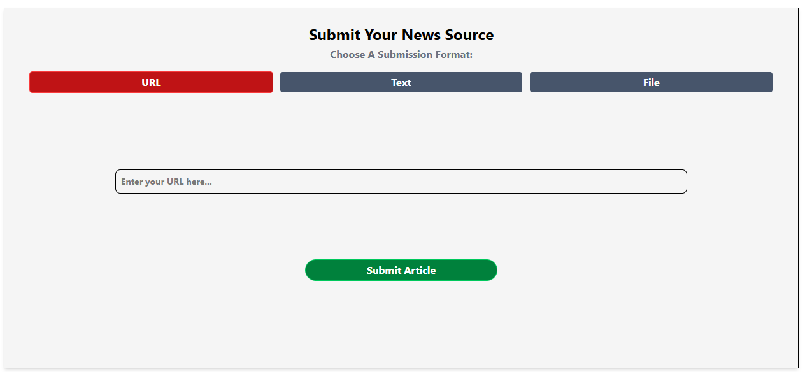
This is our first form of submission for when you want to analyse an online news article or webpage
1. When opening submission page it is automatically set to URL (if not tap on the tab labelled 'URL')
2. You will see a box with the light grey text "Enter your URL here...", this is where you paste or type the URL.
3. Then on the right side the you tap on which models you wish to use
4. Press the green "Submit Article" button to start the analysis.

### 4.2 Submitting Text
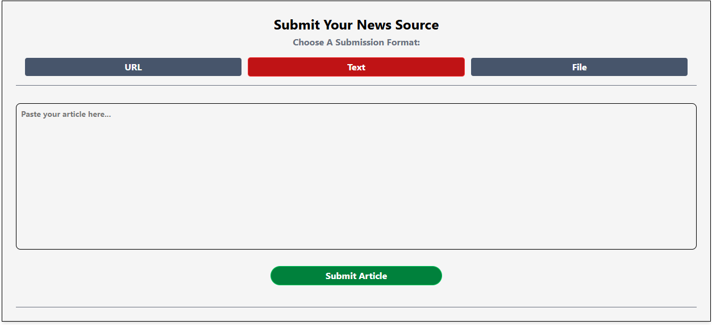
This is the second form of submission for when you want to analyse a piece of text such as a paragraph or the content is not online. (For more accurate results paste/type a lengthy amount of text)
1. Click on the dark blue/grey tab labelled 'Text', beside the URL tab.
2. Inside the box you should see text saying "Paste your article here..." here you can type or paste the text you wish to fact check
3. Then on the right side the you tap on which models you wish to use
4. Press the green "Submit Article" button to start the analysis.

### 4.3 Submitting a File
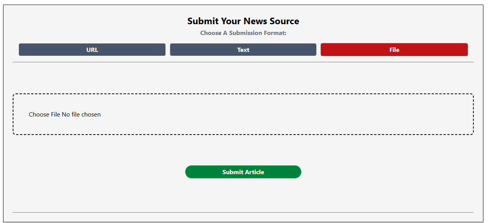
This is the final form of submission for when the content is locally stored on your device
1. Click on the dark blue/grey tab labelled 'File', beside the Text tab
2. Click on the box outlined with a broken line and has the text "Choose File No file chosen"
3. Pick one of your files that is supported by our webpage see [here](#24-supported-file-types).
4. Then on the right side the you tap on which models you wish to use
5. Press the green "Submit Article" button to start the analysis.

### 4.4 Choosing Your Models
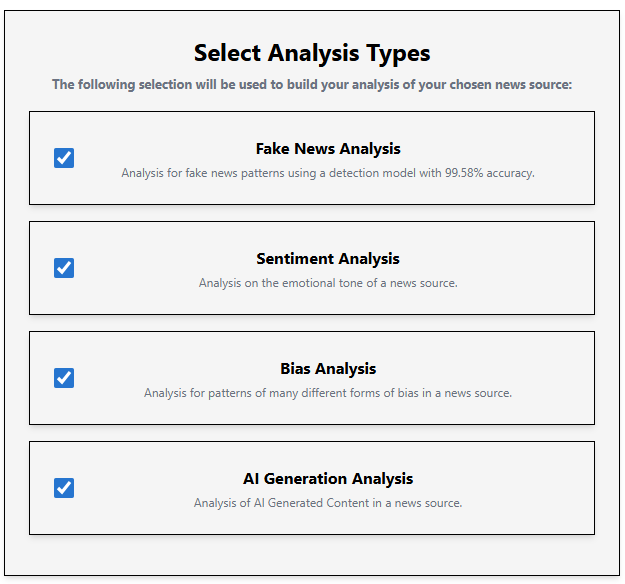
Before you submit your content you must make sure you have selected **at least one model**, your options are:
- Fake News Analysis: Analysis for fake news patterns using a detection model with 99.58% accuracy on its trained data
- Sentiment Analysis: Analysis on the emotional tone of a news source whether it is positive, negative or neutral
- Bias Analysis: Analysis for patterns of many different forms of bias in a news source, forms of bias include:
    - Racial
    - Religious
    - Gender
    - Age
    - Nationality
    - Sexuality
    - Socioeconomic
    - Educational
    - Disability
    - Political
    - Physical
- AI Generation Analysis: Analysis of AI Generated Content in a news source

### 4.5 Submission
- Once you have completed one of the three forms of submission you will be taken to a loading screen while you wait for your results.
- Once the results have been calculateed you will automatically be redirected to the results page.
- This submission will be automatically saved if you are logged into your account.

## 5 Reading your Results
Once you have gone through the different stages of submission you will be automatically redirected to the results page where you will receive a trustworthiness score and a breakdown of the results got from each model. The purpose of this page is to show you the result and explain how we go it.
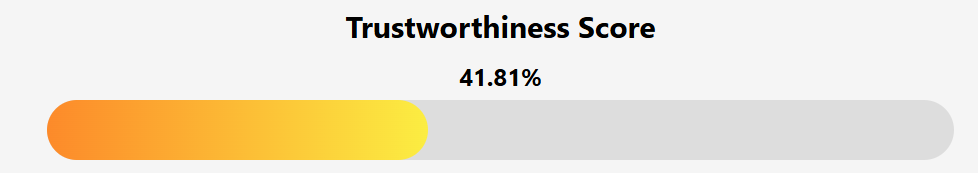
### 5.1 Trustworthiness Score
At the top of the page under the **Trustworthiness Score** heading you will see a number between 0-100 accompanied by a percentage symbol. This is your "Trustworthiness Score". The progress bar beneath that is a visual aid of how trustworthy it is being that if the bar is full it is very trustworthy. The colour of the bar will also change starting at a red to orange to yellow to green transition meant to represent going from bad to good.

This score is calulated from combining all the results of the models you selected. Each model carries a certain level of importance (weighting) to ensure that the final result is best represented by the model outputs.

Then beneath this we have our results breakdown broken into two sections

### 5.2 Text Extraction Display
On the left hand side beneath the heading 'Submitted Articel' we have a demonstration of our text extraction, it shows:
- The extracted heading (If there is one).
- The first 300 words of text (presuming there is 300 words).
- This helps verify that it is the correct text you wanted analysed.

### 5.3 Model Results
On the right hand side of the screen you will see results form the 4 different models we offer:
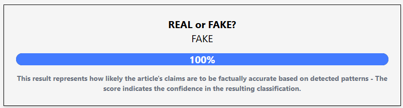
 - Pulk Model: Titled "REAL or FAKE?" analyses the articles claims and detects the accuracy of the facts based on detected patterns, it includes:
    - Heading - REAL or FAKE?
    - The outcome: will display either REAL or FAKE beneath the heading
    - Progress Bar: Indicating the result received from the model between 0-100
    - A small description of what the result actually means
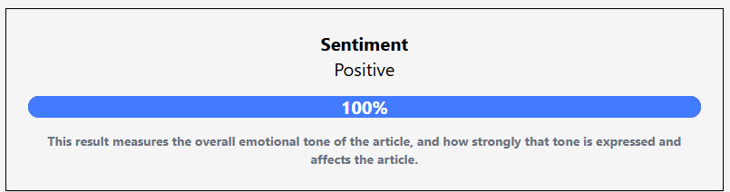
 - Sentiment Model: Titled "Sentiment" measures the overall emotional tone of the article and how strongly this emotion was conveyed through article will raise the confidence of the result, it also includes:
    - Heading - Sentiment
    - The outcome: will display either Positive, Negative or Neutral
    - Progress Bar: Indicating the result received from the model between 0-100
    - A small description of what the result actually means
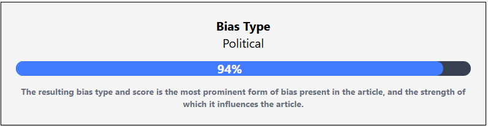
 - Bias Model: Titled "Bias Type" analyses for the 11 different forms of bias and chooses the most prominent form, these are all given different levels of importance by us because some have a higher correlation to fake news, this model includes:
    - Heading - Bias Type
    - The outcome: will be one of the 11 forms of bias see [here](#44-choosing-your-models)
    - Progress Bar: Indicating the result received from the model between 0-100
    - A small description of what the result actually means

 - Hello Simple AI Model: Titled "AI or Human?" represents whether or not the article was written by a human or generated by AI, and the confidence it has in this result, it includes:
    - Heading - AI or Human?
    - The outcome: Will either be AI or it will be Human displayed beneath the heading
    - Progress Bar: Indicating the result received from the model between 0-100
    - A small description of what the result actually means

## 6 User Account
The ability to create an account with KeepItREAL is completely optional, but doing so does gain you access to some features that the website offers, here we will talk about those features and what they include.
### 6.1 Why Create an Account
Creating an account gives you these added benefits:
 - Saving Results: If you log in after every submission your results will be automatically saved meaning you do not have to worry about losing them.
 - Account History: All of your past results will be tied to your account so that you can can scroll through previous submissions saving you have to resubmit the same article multiple times
 - Deleting past submissions: If there are certain submissions you do not want to be tied to your account you can simply delete them allowing the user to have complete control over what results we store
 - Access through other devices: Since all of your history is linked to the account rather than the device the user can access and edit the history from any device they have logged in through

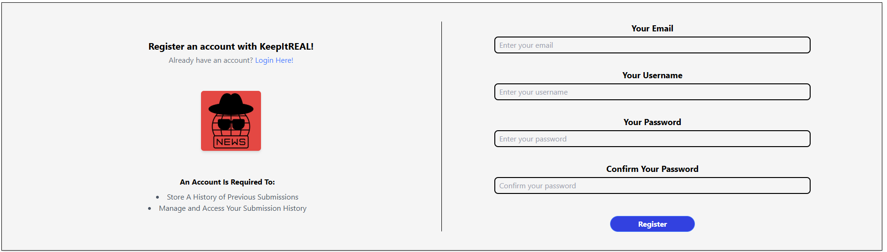
### 6.2 Registering an Account
When choosing to register an account follow these simple steps:
1. First access the homepage/submission page
2. Click "Register" in the top right hand corner within the navigation bar
3. Enter your email, username, password and confirm your password on the right hand side of the page
4. Click the blue "Register" button beneath the confirm your password textbox
5. Once registered you can use your email and password to login
Once logged in all of your submissions will start to be saved. On the left hand side of the page you will see just above our logo the option to log in if you already have an account.

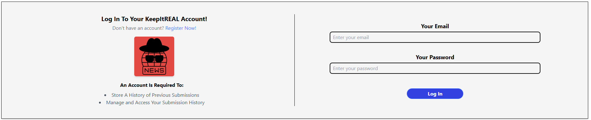
### 6.3 Logging into your Account
The steps to take to log into your account include:
1. First access the homepage/submission page
2. Click "Login" in the top right hand corner within the navigation bar
3. Enter your email and password to login
4. Click the blue "Log in" button beneath the "Your Password" text box
5. Once logged in the top right corner options will change to just "Logout"
On the left hand side of the page you will see just above our logo the option to register if you do not have an account 

### 6.4 Logging Out
The steps to take when logging out of your account include:
1. Once you have first logged in you will see the option to Logout in the top right corner where "Register | Login" used to be.
2. Click that logout button
3. The top right hand corner will change back to "Register | Login"

## 7 User History

## 8 Contact us
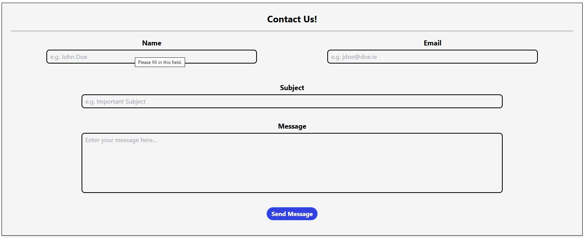
We have implemented a contact us form page so that users can reports issues or give feedback on the webpage. This information will help us further develop and future proof our web-based application

### 8.1 Submitting a Message
The contact us form can be accessed through the navigation bar found between the "Help" section and the "History" section, you will be required to submit:
 - Your Username
 - Your email
 - The subject of the message
 - The message itself
Once all these details have been entered you simply press the blue "Send Message" button.

### 8.2 Where does the Message go
Once you have submitted a message through the contact form page currently it is being stored in its own table within our database. We do this so:
- Admin can access and view your message
- The submission is confidential
- We may contact you with the provided email